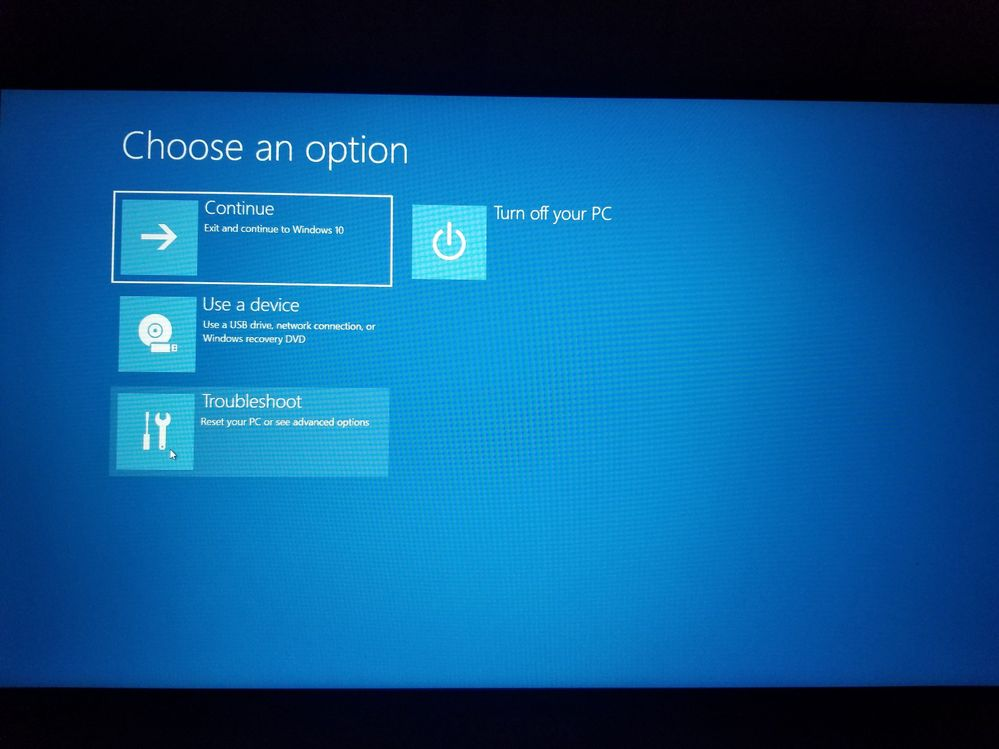
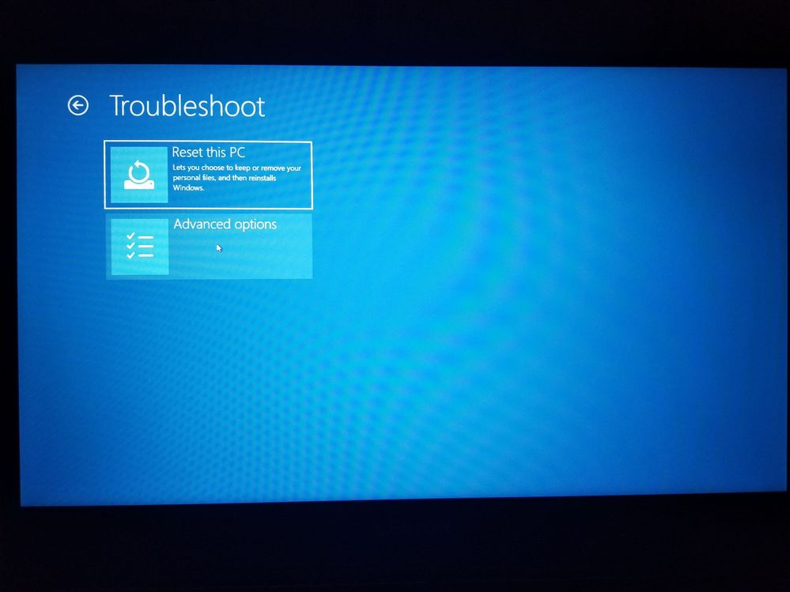
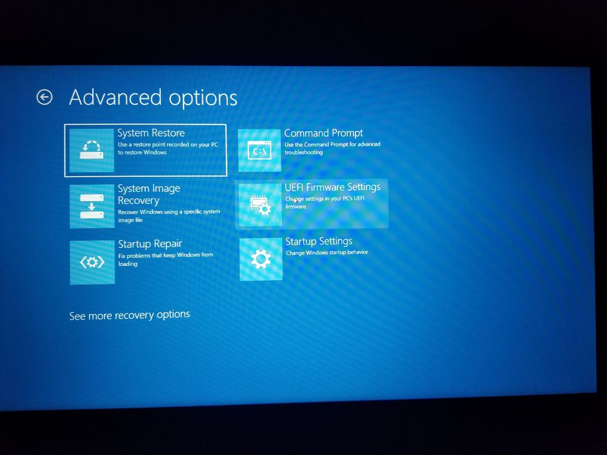
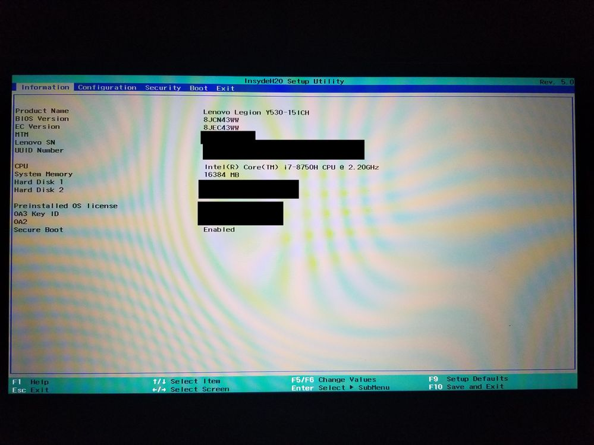
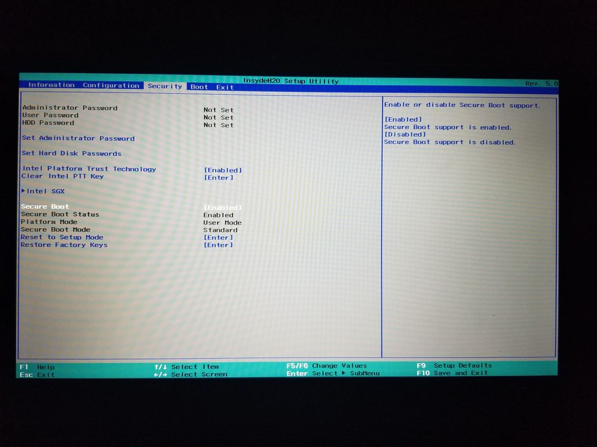

# Install Ubuntu without SecureBoot

To install Ubuntu without secureboot enabled, follow the steps below. 

To get to advanced startup, open windows settings, then click Update & Security. Select Recovery from the left hand side, and click the button labeled restart now under Advanced Startup. 

From this screen, select Troubleshoot, then Advanced Options, then UEFI Firmware Settings. 

After selecting UEFI Firmware settings, click the button labelled "Restart" on the screen that appears. 

Once in the UEFI settings, navigate to the Security tab using the arrow keys, then navigate down to 
Secure Boot. Press enter, select "Disabled" using the arrow keys, then press enter again. Once Secure Boot has been set to disabled, press F10 and select "Yes" to save the changes. 

Once the Settings have been saved, the machine will reboot. on the legion screen press the F12 button until you see the boot selection screen. 

Select your flashdrive on the list, and press enter. 

Once you have booted from your device, press an arrow key before the auto boot completes. Then highlight "try ubuntu without installing" and press e. 

Find the line with quiet splash and add "nouveau.modeset=0" then press F10.

   

Continue to [Installation](Installation.md)
